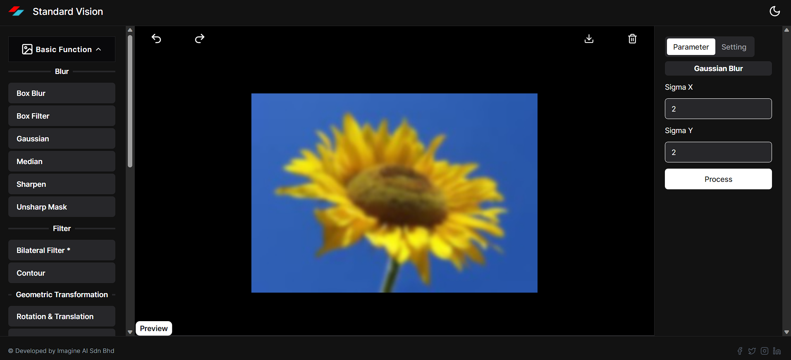
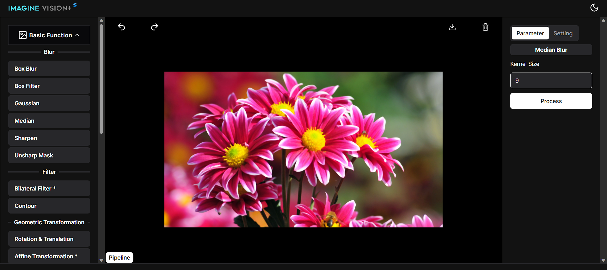
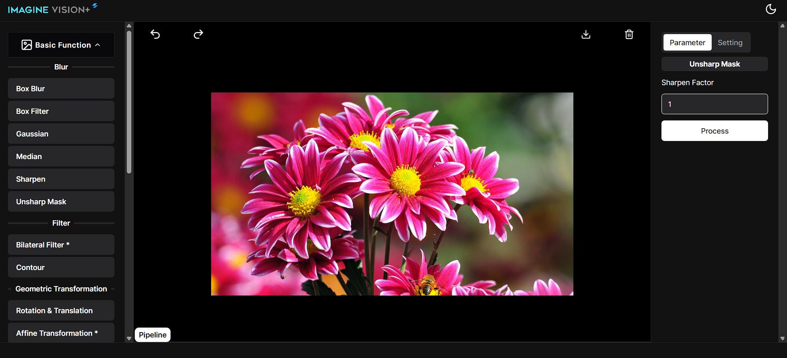

# **blur**

## boxblur

To apply a simple and fast blurring effect to an image and each pixel in the image with the average color of its neighboring pixels within a certain radius

## boxfilter

To apply a simple and fast smoothing effect to an image and each pixel in the image with the weighted average color of its neighboring pixels within a certain radius

## gaussian

apply a realistic and natural-looking blurring effect to an image and replacing each pixel in the image with the weighted average color of its neighboring pixels within a certain radius, where the weights follow a Gaussian distribution

## median

apply a noise-reducing and edge-preserving blurring effect to an image and replacing each pixel in the image with the median color of its neighboring pixels within a certain radius

## **Sharpen**

### Sharpen (prewit)

it detects edges using the respective edge detection kernels.

.png>)

### Sharpen (scharr)

it detects edges using the respective edge detection kernels.

.png>)

### Sharpen (gaussian)

it applies Gaussian blur and subtracts it to sharpen the image.

.png>)

### Sharpen (laplacian)

it enhances edges using a Laplacian sharpening kernel.

.png>)

### Sharpen (sobel)

it detects edges using the respective edge detection kernels.

.png>)

## Unsharp Mask

apply a realistic and natural-looking blurring effect to an image and subtracting a blurred version of the image from the original image, and then adding the result to the original image

