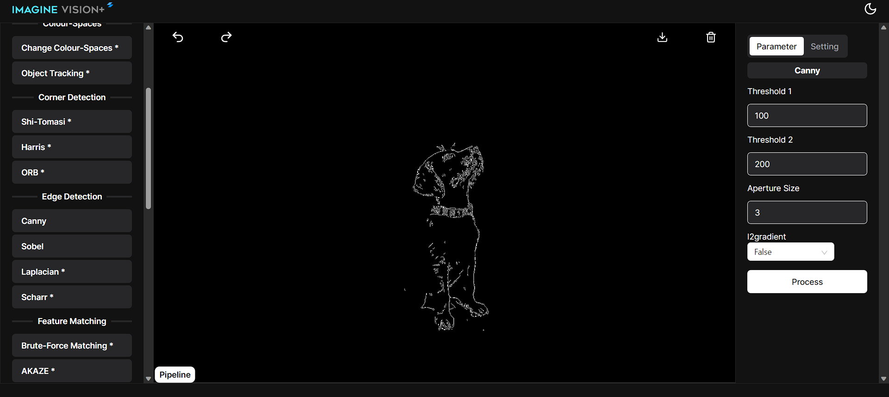

# **EdgeDetection**

## Canny

process of finding the boundaries of objects or regions in an image, which are often characterized by sharp changes in intensity or color and can be used for noise reduction,gradient calculation,double thresholding,edge tracking

### Sobel(border_default)

Uses a default or system-defined border handling method for the x-direction and y-direction of the Sobel algorithm.

.png)

### Sobel(border_constant)

Sets pixels outside the image boundary in the x-direction and y-direction to a constant value, often zero.

.png)

### Sobel(border_isolated)

Treats pixels outside the image boundary in the x-direction and y-direction as isolated or separate, typically by setting them to zero.

.png)

### Sobel(border_reflect)

Mirrors the image pixels along the boundary in the x-direction and y-direction to handle the edges.

.png)

### Sobel(border_reflect101)

Similar to "Reflect," but with a specific reflection in the x-direction and y-direction

.png)

### Sobel(border_reflect_101)

Similar to "Reflect101," but with a slightly different reflection behavior in the x-direction and y-direction

.png)

### Sobel (border_replicate)

Extends the edge pixels in the x-direction and y-direction to the outside by replicating the nearest edge pixels.

.png)
