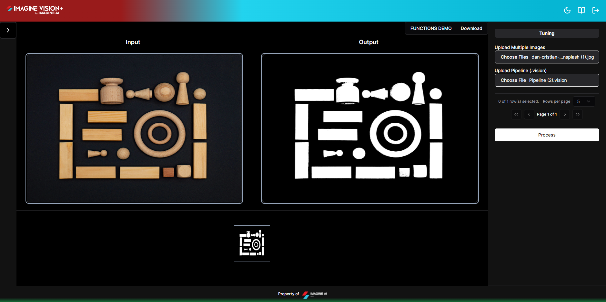

# **Iteration**

## Image Iterator

The process of iteration is used to go through the parts of an object, like an image or matrix. It is often used to do something to each part of the object. When working with images or matrices, OpenCV's iteration functions help make the process faster and better. In many computer vision tasks, like image processing, filtering, transformation, and so on, they are very important.

