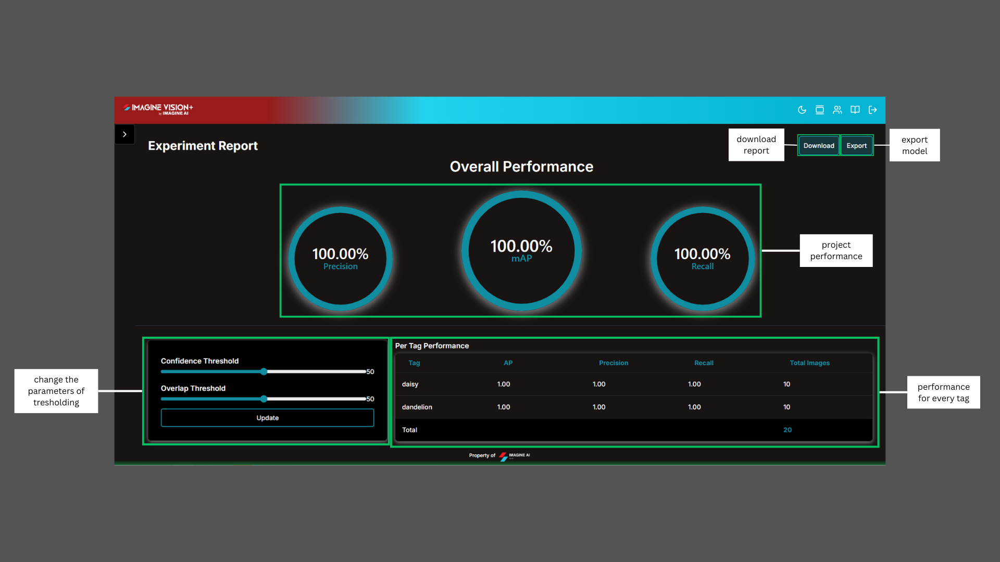

# **Classification**

## Create a new project

To create a new project, click the Create a new project button.

i. **Project Name:** Displays the names of all created projects.  
ii. **Project Type:** Indicates the type of project (Classification & Object Detection). 
iii. **Category:** Describes the project's optimization focus, such as speed or accuracy for edge devices.
iv. **Last Modified:** Shows the date and time of the most recent changes made to the project. 
v. **Visible:** Indicates whether the project is published by the user. 
vi. **More:** Provides options to publish, update the publication, or delete the publication of the project. 

## Fill the project information

- Enter the project name and description.
- Select the project type
- Choose the project category.

## Add Image

- Add the unlabelled image to the project.
- Click the image to open the classification popup.

## Classification Popup

- Create a label inside the popup.
- Select the label and submit it.
- Start the training process after completing all classifications on every image.

## Experiment Tracking

- Use the Refresh button to check if the training status is "Completed."
- Click the experiment row to view the Experiment Performance. This will be available only after the training status is marked as "Completed."
- Click the Predict button to publish the experiment and navigate directly to the Predict page.
- Click the Report button to navigate directly to the Report page.

## Predict

- The Export button is used to export the experiment to the selected model.
- A sample image refers to a trained image.
- Upload an image to assess the experiment's model performance based on the prediction output.
- The Threshold parameter affects model performance and changes the prediction output.

## Report

- The Export button is used to export the experiment to the selected model.
- The Download button will download the report as a PDF.
- The Threshold parameter will affect the overall performance and alter the performance of each tag.

