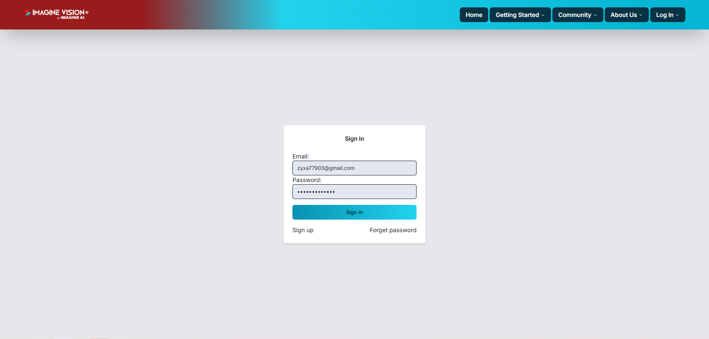

# User Manual

1. Signing Up

   Users must fill out the sign-up form in order to gain access to the system before signing in.

   

2. Sign In

   Users email a verification number after completing the registration process. They safeguard their system login using this code.

   

3. Imagine Vision+ Features

   Currently, Imagine Vision+ features provides users with a robust toolkit to efficiently navigate through the complexities of developing AI Computer Vision models,
   enabling them to harness the full potential of visual data for various applications (only traditional computer vision algorithm).

   

4. Side Bar

   By selecting "My Dashboard" or "User Profile" from the navigation menu, users can access the profile page and edit their personal information. This points users in the direction of the relevant area where they can edit their profile information as desired.

   

5. Profile User

   In order to purchase Imagine Vision+ features, users can modify their billing address and user information. Furthermore, they can easily access this section to view every item they have purchased, giving them a thorough overview of all of their transactions and facilitating easy account management.

   

6. Create Project

   Users can choose from a variety of project templates on the Create Project page for image processing tasks. Users can add additional customisation to their projects by selecting features they need in addition to the "New Project" option. Additionally, this page gives users access to their past work and facilitates effective project management by displaying visibility into previously created projects.

   

7. Project

   After creating a project and choosing a template, the user can start modifying the image processing right away by going to the "Pipeline" area. Here, users can easily explore and choose more options via the sidebar menu, giving them more freedom and control over the image processing capabilities of their project.

   

8. Project Side Bar

   Users can now customise their image processing to fit their needs and preferences by using a range of features.

   
